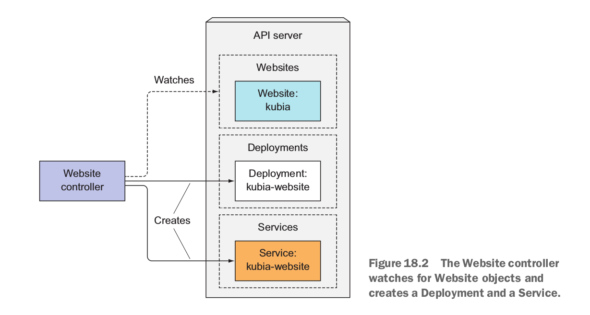
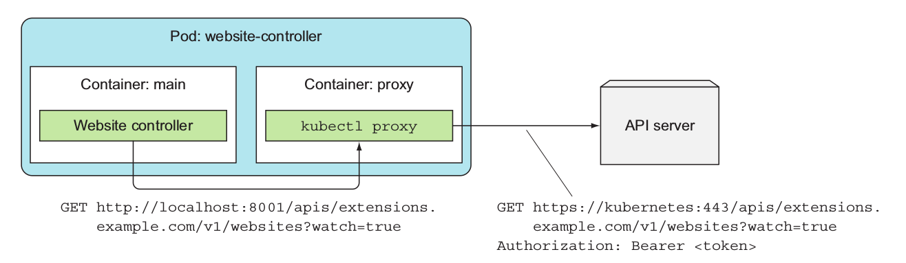

# Kubernetes Custom Resource Definitions

Kubernetes is a highly extensible platform.  It supports many [extension points](https://kubernetes.io/docs/concepts/extend-kubernetes/extend-cluster/) to extend and customize your Kubernetes deployment without touching the core kubernetes source code.  Here I focus on [Custom Resource Definitions](https://kubernetes.io/docs/concepts/extend-kubernetes/api-extension/custom-resources/#customresourcedefinitions), what they are, why they are useful, and how to implement them using [Kubebuilder](https://book.kubebuilder.io/) and [Operator SDK](https://github.com/operator-framework/operator-sdk).  I will explain CRDs using the excellent example from the book [Kubernetes in Action](https://www.manning.com/books/kubernetes-in-action) by [Marko Lukša](https://github.com/luksa).

**Note, this is an EXCELLENT book on Kubernetes and I highly recommend you read it!**

We will first dive into Marko's example as it is simple and clear.  However, his implementation is intentionally very simple and as he notes "barely working".  So we will re-implement his example using Kubebuilder and Operator SDK which enable you to build production grade CRDs and Controllers quickly.  

## What and Why?

Kubernetes provides a rich set of API primitives to specify the desired state of your system.  However, when it comes to deploying complex infrastructure such as Prometheus, ELK stack, etc that have multiple components that interact with each other and need to be configured, this becomes very complex.  CustomResourceDefinitions are a means to create new API resources that model your problem/solution space and abstract away this complexity.  For example, the [Prometheus Operator](https://coreos.com/operators/prometheus/docs/latest/user-guides/getting-started.html) from CoreOS defines the following CRDs:

* [Prometheus](./prometheus/prometheus.yaml) defines the desired state of the Prometheus deployment
* [AlertManager](./prometheus/alertmanagers.yaml) describes an Alertmanager cluster
* [PrometheusRule](./prometheus/prometheus-rule.yaml) defines alerting rules for a Prometheus instance
* [ServiceMonitor](./prometheus/servicemonitor.yaml) defines the set of targets to be monitored by Prometheus.  You select Services (and the underlying Pods) to be monitored using labels and label selectors.

Anyone that understands Prometheus, would understand these resources.  Instead of thinking in terms of Deployments, Statefulsets, Services etc, you can now think in concepts you are familiar with.  This is the value of Custom Resource Definitions.  Of course, the Kubernetes API primitives are still there. To deploy Prometheus, Alertmanager, Exporters, Grafana etc, the Prometheus Operator deploys Deployments, StatefulSets, Services and of course, Pods, to bring up the components in a resilient manner.  This is done through an implementation of a custom controller that consumes the CRDs and creates the Kubernetes resources to deploy and configure the components.  

To deploy the Prometheus Operator, follow the instructions [here](./prometheus/README.md)

## Marko Lukša Website Example ##

To demonstrate the process of creating a CRD, let's first deploy [Marko Lukša's](https://github.com/luksa) example.

The scenario is as follows:

We want to create a new resource called `WebSite`.  When we create this resource, a new WebSite based on the source code located at the specified git repo will be deployed and exposed in Kubernetes.  This will require a Deployment and Service resources to be created.

1. First step is to define our Website Custom Resource.  You do so by creating a `CustomResourceDefinition` resource. 

```sh

#We have a CRD defined in website-crd.yaml, create it like any other resource
kubectl create -f website-crd.yaml

#Verify it has been created
kubectl get customresourcedefinitions

NAME                              AGE
websites.extensions.example.com   16s

```

2. Now that the CRD has been created, create an instance of our Website resource.

```sh
kubectl create -f website.yaml

#Verify it has been created
kubectl get ws

NAME      AGE
kubia     4s

```
3. At this point, nothing happens because there is no controller that watches for the Website resource.  So we need to deploy a custom controller.  The source code for the controller is [here](https://github.com/luksa/k8s-website-controller)

```sh
#The website-controller will need a serviceAccount with sufficient privileges to access the kube-apiserver
kubectl create serviceaccount website-controller
kubectl create clusterrolebinding website-controller --clusterrole=cluster-admin --serviceaccount=default:website-controller

#create the website-controller as a deployment
kubectl create -f website-controller.yaml

#see what pods get deployed
kubectl get pods

#Notice the kubia-website pod has been deployed
NAME                                  READY     STATUS    RESTARTS   AGE
kubia-website-5645d5dc9-np68m         2/2       Running   0          3m
website-controller-84f9785c68-lzgmn   2/2       Running   1          3m

```

Below is a diagram from the [Kubernetes in Action](https://www.manning.com/books/kubernetes-in-action) book that describes the series of events that occur when the Website custom resource is deployed.



The website-controller pod contains 2 containers.

1. The controller itself that watches for 'Website' resources and deploys the website pod (which is just an nginx container that serves a static page)
2. A kubectl-proxy container as a 'side-car' container.  

The controller needs to communicate with the kube-apiserver in an authenticated manner.  The simplest way is to start up kubectl in proxy mode.  Since containers within the same pod share the same network namespace, the controller container can access the proxy via 'localhost'.  On start up, the controller gets a list of all 'Website' resource by sending a GET request like so:

```sh
#Notice the api path is group/version/resource as defined in the CRD
http://localhost:8001/apis/extensions.example.com/v1/websites?watch=true
```

See the following diagram from the [Kubernetes in Action](https://www.manning.com/books/kubernetes-in-action) book.



## Kubebuilder

Kubebuilder is part of the Kubernetes [api-machinery SIG](https://groups.google.com/forum/#!forum/kubernetes-sig-api-machinery) and is fast on track for being the framework for building custom CRDs, Controllers and [Webhooks](https://github.com/kubernetes-sigs/kubebuilder/blob/master/docs/book/beyond_basics/what_is_a_webhook.md).

The Kubebuilder docs are excellent.  See the [installation and setup](https://book.kubebuilder.io/getting_started/installation_and_setup.html) docs then see [here](./website-kubebuilder/README.md) for instructions on how to implement our custom CRD/Controller, debug, and deploy to Kubernetes.

## Operator SDK

**Note that Operator SDK is alpha software!  Proceed with caution!**

Operator SDK is part of CoreOS' [Operator Framework](https://github.com/operator-framework) and is the basis for many Operator implementations.  It differs from Kubebuilder in that in addition to Golang, you can create Operators using Ansible.

See the [user guide](https://github.com/operator-framework/operator-sdk/blob/master/doc/user-guide.md) to install Operator SDK locally on your machine.  Note the dependencies!  After you have installed the sdk, see [here](./website-operator-sdk/README.md) for instructions on how to implement the Website CRD and custom controller, debug and to deploy to Kubernetes.

## References ##

- [Kuberenetes Deep Dive Series by RedHat.  Excellent overview of the kube-apiserver and how state is stored in etcd](https://blog.openshift.com/kubernetes-deep-dive-api-server-part-1/)
- [Kubernetes Code Generation Deep Dive by RedHat](https://blog.openshift.com/kubernetes-deep-dive-code-generation-customresources/)
- [Writing Kubernetes Custom Controllers.](https://medium.com/@cloudark/kubernetes-custom-controllers-b6c7d0668fdf)Describes how to implement custom controllers using client-go.  Read this prior to diving into the sample-controller as it describes an established pattern for implementing controllers.
- [sample-controller.](https://github.com/kubernetes/sample-controller) Example implementing a customer controller using client-go library.
- [controller-runtime library docs.](https://godoc.org/github.com/kubernetes-sigs/controller-runtime/pkg) Both Kubebuilder and Operator SDK depends on this library.  It primarily provides the lower-level types and functions to integrate with the api server, watch for events, provide a internal work queue to decouple the Informer from the Reconciler and more.
- [Kubebuilder docs](https://book.kubebuilder.io/)
- [Operator SDK docs](https://github.com/operator-framework/operator-sdk)
